# Threat Hunt Report: Another Day, Part Two

**Organization:** Nimbus Health  
**Investigation Window:** 25–30 May 2026  
**Primary Device:** `NH-WKS-IT-01`  
**Primary Account:** `m.reed`  
**Environment:** `corp.nimbushealth.com` / `NIMBUS`  
**Platforms:** Microsoft Defender for Endpoint, Microsoft Sentinel / Log Analytics  
**Query Language:** Kusto Query Language (KQL)

---

## Contents

- [Executive Summary](#executive-summary)
- [Attack Chain at a Glance](#attack-chain-at-a-glance)
- [Environment and Authorization Context](#environment-and-authorization-context)
- [Credential Exposure](#credential-exposure)
- [Access and Initial Intrusion](#access-and-initial-intrusion)
- [First Keyboard Activity and Operator Discovery](#first-keyboard-activity-and-operator-discovery)
- [Benign File Deletions vs. Suspicious Activity](#benign-file-deletions-vs-suspicious-activity)
- [Discovery of Internal Resources and HR-Related Content](#discovery-of-internal-resources-and-hr-related-content)
- [Domain and Group Discovery](#domain-and-group-discovery)
- [Collection and Staging](#collection-and-staging)
- [Packaging and Exfiltration](#packaging-and-exfiltration)
- [Persistence and Scope](#persistence-and-scope)
- [Incident Response](#incident-response)
- [Key Findings](#key-findings)
- [MITRE ATT&CK Mapping](#mitre-attck-mapping)
- [Conclusion](#conclusion)

---

## Executive Summary

Nimbus Health experienced a confirmed hands-on-keyboard intrusion involving the IT workstation `NH-WKS-IT-01` and the account `m.reed`. The investigation separated broad authentication noise from the deliberate intrusion, identified successful Remote Desktop access, and anchored the incident timeline on the first genuine operator-issued commands rather than on routine session initialization.

The compromised account belonged to an **IT Support Technician** whose documented privilege level was **Standard User**. Although the user was authorized for the IT workstation, IT share, and limited workstation-support functions, the attacker exceeded those boundaries, accessed sensitive information, staged files, and removed data through the RDP channel.

One staged file was a personnel record containing personal information. That elevated the incident from a purely technical compromise to a **privacy/data-breach matter** requiring disclosure assessment in addition to containment and remediation.

The hunt found **no evidence of attacker persistence** and no evidence that attacker execution successfully expanded beyond `NH-WKS-IT-01`.

**Final assessment:** Confirmed compromise involving unauthorized interactive access, role abuse, sensitive-data access, staging, and exfiltration.

---

## Attack Chain at a Glance

| Stage | Evidence |
|---|---|
| Initial access | Successful `RemoteInteractive` logon to `NH-WKS-IT-01` from `116.45.242.115` |
| Discovery | `whoami`, `hostname`, `ipconfig /all`, `whoami /groups`, domain user/group enumeration |
| Resource access | `net view \\NH-FS-01` and access to IT/HR share content |
| Collection | Local creation of `access_request_queue_20260526.csv`, `employee_record_EMP-87291_20260527.txt`, and `access_review_notes_20260528.txt` |
| Staging | `support_review_202605.zip` created locally |
| Exfiltration | Archive copied to `\\tsclient\G\Temp\NimbusSupport\support_review_202605.zip` |
| Persistence | No attacker persistence identified |
| Scope | One confirmed compromised endpoint: `NH-WKS-IT-01` |


---

## Environment and Authorization Context
---


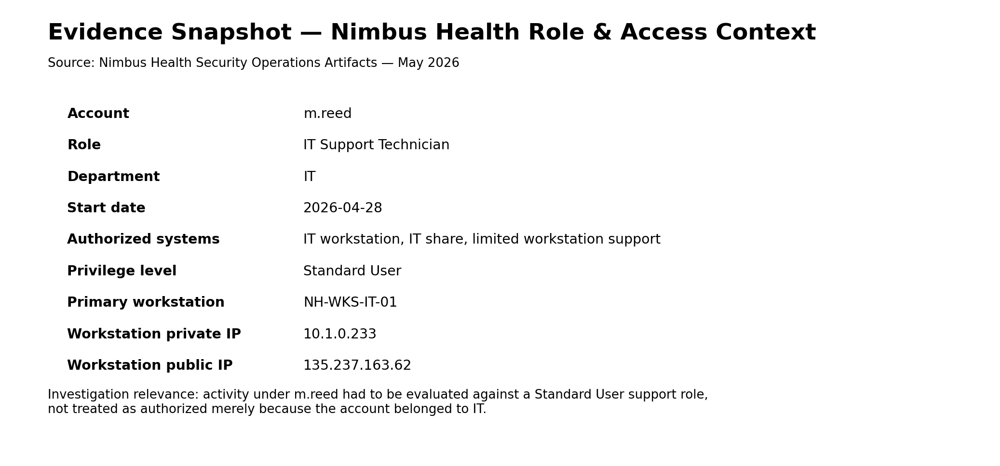

Nimbus Health's supplied role matrix identified `m.reed` as an **IT Support Technician** hired on 28 April 2026 with **Standard User** privileges and access limited to the IT workstation, IT share, and limited workstation support.

| Attribute | Value |
|---|---|
| Account | `m.reed` |
| Role | IT Support Technician |
| Privilege Level | Standard User |
| Primary Device | `NH-WKS-IT-01` |
| Device Private IP | `10.1.0.233` |
| Device Public IP | `135.237.163.62` |
| Authorized Access | IT workstation, IT share, limited workstation support |

---

## Credential Exposure

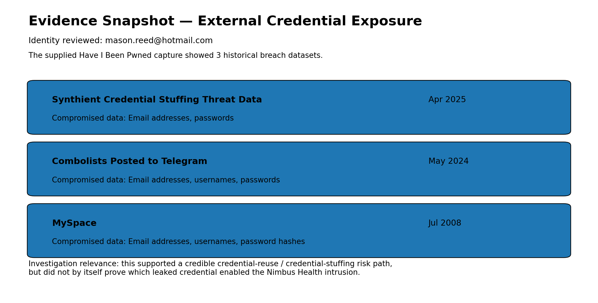

OSINT review of `mason.reed@hotmail.com` found the identity in **three historical breach datasets**. This established a credible credential-reuse / credential-stuffing risk path, even though it did not by itself prove which leaked credential enabled the intrusion.

---

## Access and Initial Intrusion

The first clearly relevant successful remote access came from `116.45.242.115`, followed later by additional activity from `45.131.194.61`.

### Access KQL

```kql
DeviceLogonEvents
| where TimeGenerated between (datetime(2026-05-25) .. datetime(2026-05-30 23:59:59))
| where DeviceName startswith "nh-wks-it-01"
| where AccountName == "m.reed"
| where isnotempty(RemoteIP)
| where ActionType == "LogonSuccess"
| project TimeGenerated, RemoteIP, LogonType
| order by TimeGenerated asc
```

### Successful logons from `116.45.242.115`

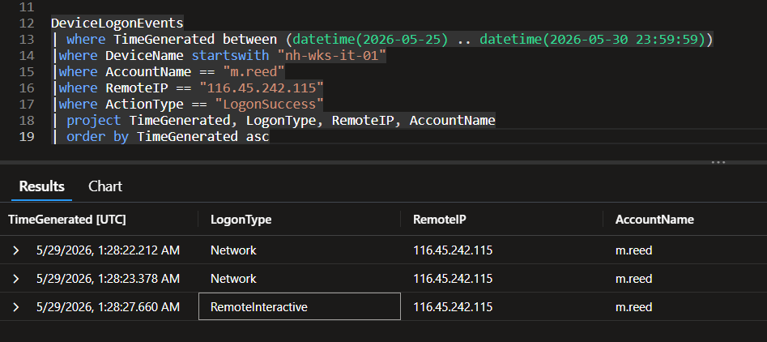

This result shows the progression from `Network` logons to a successful `RemoteInteractive` session.

### Successful logon timeline

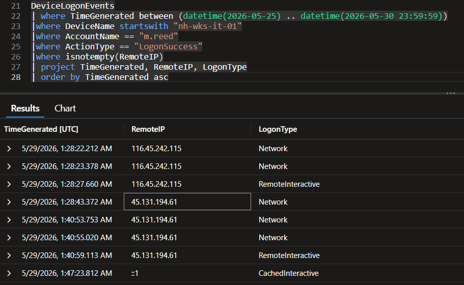

This expanded view shows:

- `2026-05-29 01:28:22.212` — `116.45.242.115` / `Network`
- `2026-05-29 01:28:23.378` — `116.45.242.115` / `Network`
- `2026-05-29 01:28:27.660` — `116.45.242.115` / `RemoteInteractive`
- `2026-05-29 01:28:43.372` — `45.131.194.61` / `Network`
- `2026-05-29 01:40:53.753` — `45.131.194.61` / `Network`
- `2026-05-29 01:40:55.020` — `45.131.194.61` / `Network`
- `2026-05-29 01:40:59.113` — `45.131.194.61` / `RemoteInteractive`
- `2026-05-29 01:47:23.812` — `::1` / `CachedInteractive`

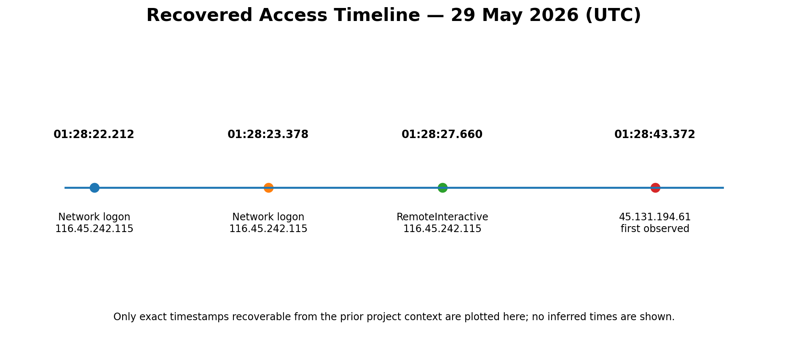

---

## First Keyboard Activity and Operator Discovery

A key judgment during the hunt was distinguishing **session setup artifacts** from **actual attacker actions**.

### Post-logon system initialization

```kql
DeviceProcessEvents
| where TimeGenerated between (datetime(2026-05-25) .. datetime(2026-05-30 23:59:59))
| where DeviceName startswith "nh-wks-it-01"
| where AccountName == "m.reed"
| where TimeGenerated >= datetime(2026-05-29 01:28:27)
| project TimeGenerated, FileName, ProcessCommandLine, InitiatingProcessFileName, InitiatingProcessCommandLine
| order by TimeGenerated asc
```

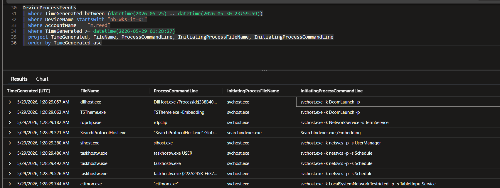

These processes are expected session startup behavior and should not be mistaken for the first true attacker commands.

### First real interactive commands

```kql
DeviceProcessEvents
| where TimeGenerated between (datetime(2026-05-29 01:30:00) .. datetime(2026-05-29 01:35:00))
| where DeviceName startswith "nh-wks-it-01"
| where AccountName == "m.reed"
| where InitiatingProcessFileName =~ "cmd.exe" or FileName =~ "cmd.exe"
| project TimeGenerated, FileName, ProcessCommandLine, InitiatingProcessFileName, InitiatingProcessCommandLine
| order by TimeGenerated asc
```

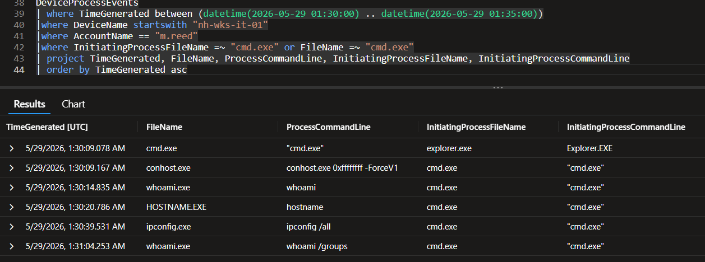

This was the first strong hands-on-keyboard evidence. The operator issued:

- `cmd.exe`
- `whoami`
- `hostname`
- `ipconfig /all`
- `whoami /groups`

That sequence is classic environment and privilege discovery.

---

## Benign File Deletions vs. Suspicious Activity

The investigation also reviewed potentially misleading file-deletion activity to determine whether it represented attacker cleanup or normal application behavior.

### OneDrive deletion activity

```kql
DeviceFileEvents
| where TimeGenerated between (datetime(2026-05-29 01:28:00) .. datetime(2026-05-29 01:35:00))
| where DeviceName startswith "nh-wks-it-01"
| where ActionType contains "Delete"
| project TimeGenerated, ActionType, FileName, FolderPath, InitiatingProcessFileName, InitiatingProcessCommandLine, InitiatingProcessAccountName
| order by TimeGenerated asc
```

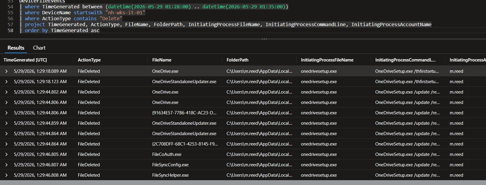

These deletions were driven by `OneDriveSetup.exe` and were treated as benign application behavior rather than attacker cleanup. The activity was attributed to `OneDriveSetup.exe` and assessed as benign application maintenance rather than anti-forensics.

---

## Discovery of Internal Resources and HR-Related Content

The attacker pivoted from host discovery into network/share discovery and then into HR-related material.

### Access to `NH-FS-01`

```kql
DeviceProcessEvents
| where TimeGenerated between (datetime(2026-05-29) .. datetime(2026-05-29 23:59:59))
| where DeviceName startswith "nh-wks-it-01"
| where AccountName == "m.reed"
| where ProcessCommandLine contains "NH-FS-01"
| project TimeGenerated, ProcessCommandLine
| order by TimeGenerated asc
```

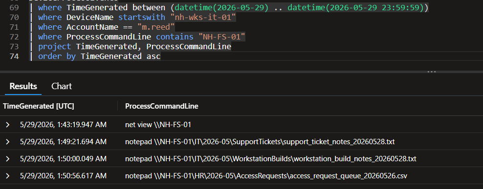

Recovered commands included:

- `net view \\NH-FS-01`
- `notepad \\NH-FS-01\IT\2026-05\SupportTickets\support_ticket_notes_20260528.txt`
- `notepad \\NH-FS-01\IT\2026-05\WorkstationBuilds\workstation_build_notes_20260528.txt`
- `notepad \\NH-FS-01\HR\2026-05\AccessRequests\access_request_queue_20260526.csv`

That last item is important because it shows movement into HR-related material beyond the user's documented support scope.

### Additional process review containing `HR`

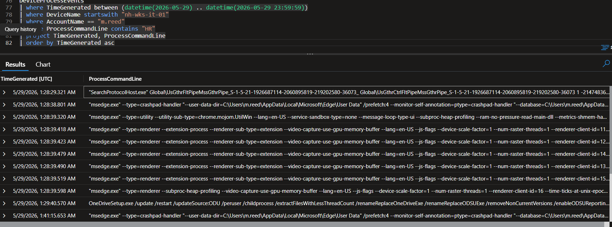

This view is noisier, but still useful as supporting evidence that the operator's activity overlapped HR-related terms and artifacts.

---

## Domain and Group Discovery

The attacker also performed account/group discovery inside the environment.

```kql
DeviceProcessEvents
| where TimeGenerated between (datetime(2026-05-29) .. datetime(2026-05-29 23:59:59))
| where DeviceName startswith "nh-wks-it-01"
| where AccountName == "m.reed"
| where FileName in~ ("net.exe", "net1.exe")
| project TimeGenerated, FileName, ProcessCommandLine
| order by TimeGenerated asc
```

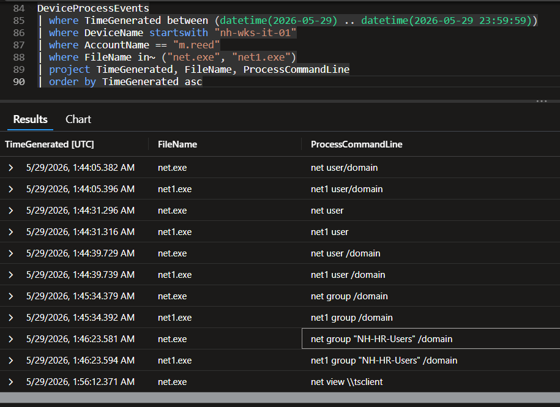

Recovered discovery included:

- `net user /domain`
- `net user`
- `net group /domain`
- `net group "NH-HR-Users" /domain`
- `net view \\tsclient`

The `NH-HR-Users` enumeration is especially relevant because it further supports interest in HR-related resources.

---

## Collection and Staging

The evidence for collection became much stronger once file creation artifacts appeared in the user's working directories.

```kql
DeviceFileEvents
| where TimeGenerated between (datetime(2026-05-29 01:49:00) .. datetime(2026-05-29 01:55:00))
| where DeviceName startswith "nh-wks-it-01"
| where InitiatingProcessAccountName == "m.reed"
| project TimeGenerated, ActionType, FileName, FolderPath, InitiatingProcessFileName
| order by TimeGenerated asc
```

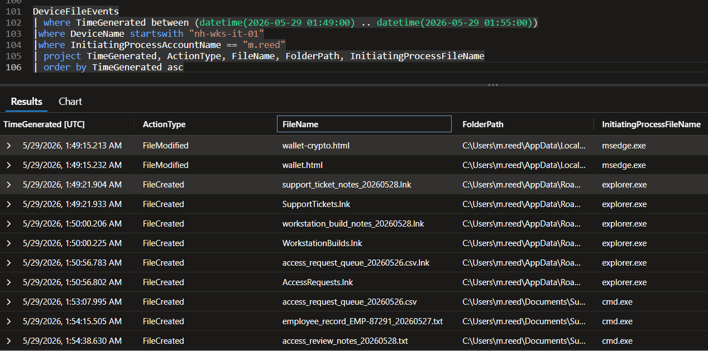

Notable staged files included:

- `access_request_queue_20260526.csv`
- `employee_record_EMP-87291_20260527.txt`
- `access_review_notes_20260528.txt`

These events show the operator moving from remote file access to creation of local working copies for staging.

### Sensitivity conclusion

The presence of `employee_record_EMP-87291_20260527.txt` supports the finding that personal/employee information was involved, which is what triggered the privacy/data-breach obligation.

---

## Packaging and Exfiltration

The staged files were then consolidated into a ZIP and copied to a client-accessible location.

```kql
DeviceFileEvents
| where TimeGenerated between (datetime(2026-05-29) .. datetime(2026-05-29 23:59:59))
| where DeviceName startswith "nh-wks-it-01"
| where FileName == "support_review_202605.zip"
| project TimeGenerated, ActionType, FileName, FolderPath, InitiatingProcessFileName, InitiatingProcessCommandLine
| order by TimeGenerated asc
```

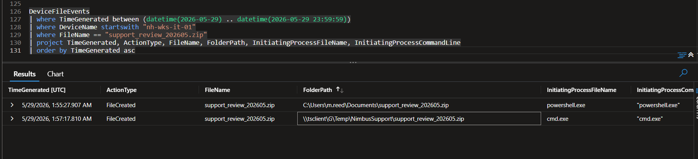

Recovered events showed:

- `2026-05-29 01:55:27.907` — ZIP created locally via `powershell.exe`
- `2026-05-29 01:57:17.810` — ZIP created/copied to `\\tsclient\G\Temp\NimbusSupport\support_review_202605.zip` via `cmd.exe`

### RDP transfer indicator — `tsclient`

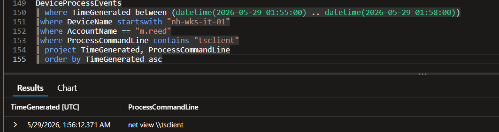

The `\\tsclient` reference is strong corroboration that the archive was transferred across the active RDP session boundary.

### Exfiltration conclusion

**Exfiltration:** Confirmed  
**Channel:** RDP / `\\tsclient`  
**Archive:** `support_review_202605.zip`

---

## Persistence and Scope

The hunt explicitly looked for persistence and multi-host expansion.

### Findings

- **Persistence:** No attacker persistence observed
- **Confirmed compromised endpoints:** `1`
- **Confirmed endpoint:** `NH-WKS-IT-01`

These negative findings matter because they establish boundaries around the incident rather than overstating it.

---

## Incident Response

### First Containment Action

**Isolate `NH-WKS-IT-01` from the network.**

Follow-on actions:

1. Reset the credentials associated with `m.reed`.
2. Revoke active sessions and authentication tokens.
3. Preserve endpoint, authentication, and RDP telemetry.
4. Determine the exact contents of the exfiltrated personnel record.
5. Escalate the matter to privacy, legal, and compliance stakeholders.
6. Review and restrict RDP exposure.
7. Require MFA for remote administrative access where possible.

---

## Key Findings

| Question | Conclusion |
|---|---|
| Compromised account | `m.reed` |
| User role | IT Support Technician |
| Privilege level | Standard User |
| Historical breach datasets found | `3` |
| Primary device | `NH-WKS-IT-01` |
| Device public IP | `135.237.163.62` |
| Initial successful source IP | `116.45.242.115` |
| Second successful source IP | `45.131.194.61` |
| Successful remote logon type | `RemoteInteractive` |
| Confirmed data exfiltration | Yes |
| Exfiltration path | `\\tsclient\G\Temp\NimbusSupport\support_review_202605.zip` |
| Sensitive data | Employee / personnel information |
| Persistence established | No evidence observed |
| Successful expansion to other endpoints | No evidence observed |
| First containment action | Isolate `NH-WKS-IT-01` |

---

## MITRE ATT&CK Mapping

| Tactic | Technique | Evidence |
|---|---|---|
| Initial Access | T1078 — Valid Accounts | Compromised credentials used for access |
| Remote Services | T1021.001 — Remote Desktop Protocol | Successful `RemoteInteractive` session |
| Discovery | T1082 — System Information Discovery | `hostname`, `whoami`, `ipconfig /all` |
| Discovery | T1069 / T1087 | `net user`, `net group`, domain/group discovery |
| Collection | T1005 — Data from Local System | Accessed and created local copies of sensitive files |
| Collection | T1074 — Data Staged | Files consolidated before transfer |
| Exfiltration | T1048 / remote-session transfer | ZIP moved through `\\tsclient` |
| Persistence | — | Not established |
| Lateral Movement | — | Not established beyond one endpoint |

---

## Conclusion

From the evidence reviewed, Nimbus Health experienced a confirmed credential-driven, hands-on-keyboard intrusion against `NH-WKS-IT-01`. The attacker gained interactive RDP access, performed host and domain discovery, reached beyond the account's authorized role, staged sensitive HR-related files including an employee record, and transferred those materials out of the environment through `\\tsclient`.

**Final disposition:** Confirmed security incident requiring containment, credential remediation, and privacy/data-breach review.
